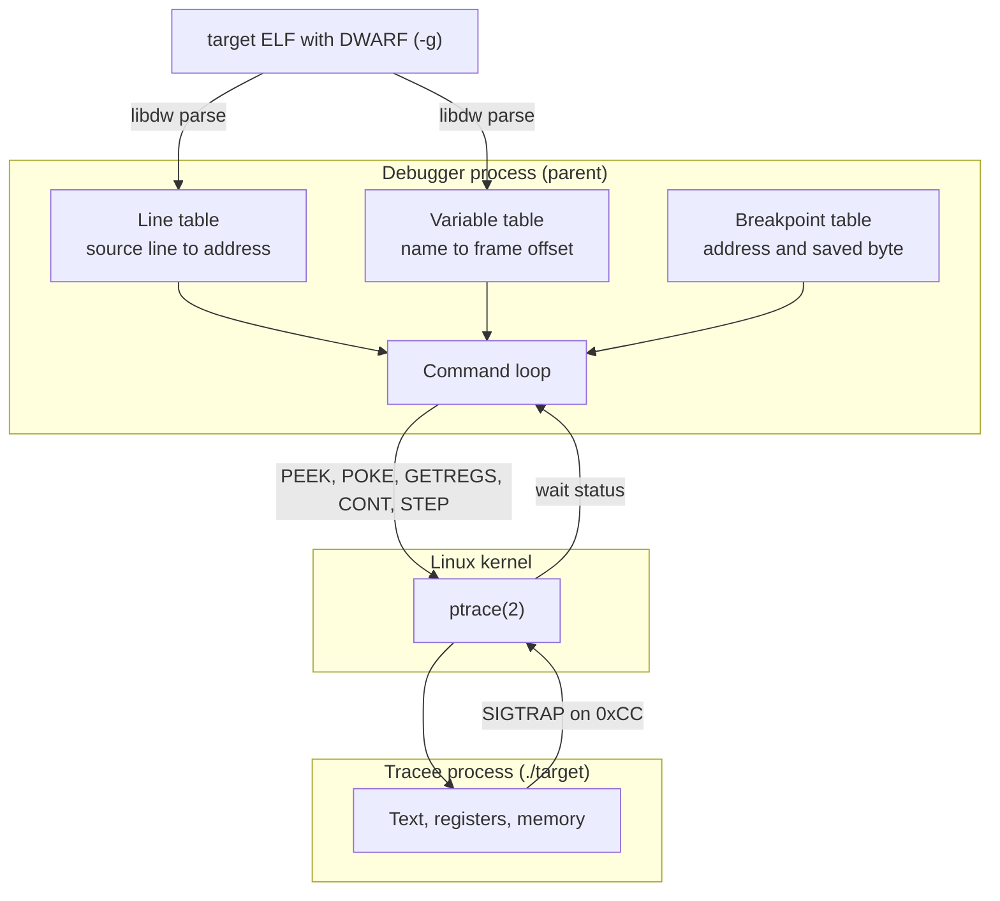
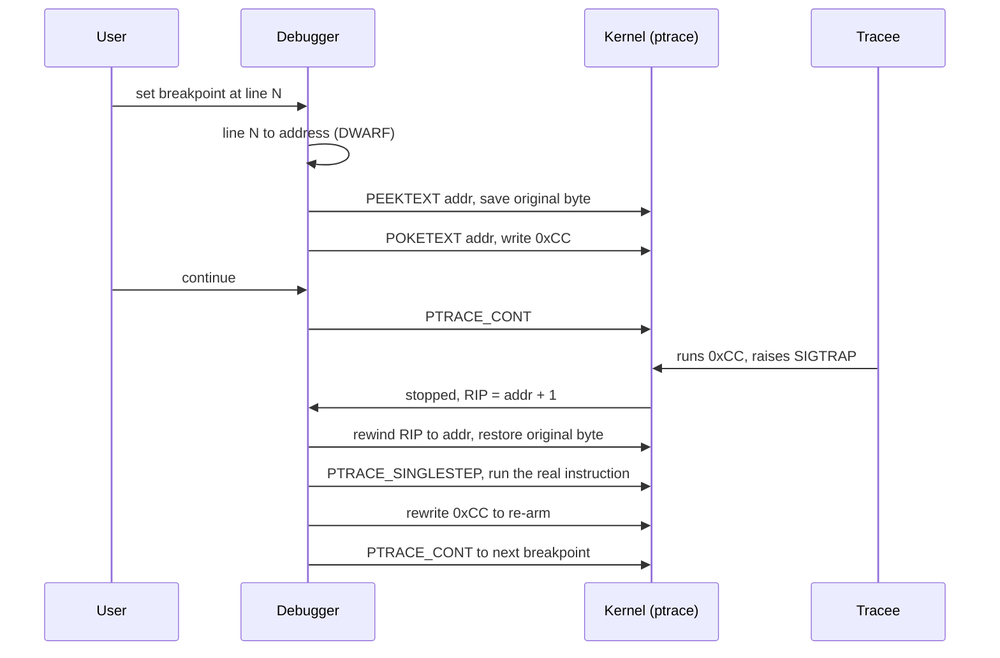

# linux-debugger

A small source-level debugger for x86-64 Linux, written from scratch in C. It drives a target process with `ptrace(2)`, reads DWARF debug info through elfutils' `libdw` to map source lines and local variables to addresses, and implements software breakpoints by patching `INT3` (`0xCC`) into the tracee's text.

This is a learning and portfolio project: a single translation unit, no external debugger libraries beyond `libdw` for DWARF parsing. The goal was to understand how a debugger actually works at the kernel-interface level, not to reimplement GDB.

## How it fits together

A debugger is two processes and a kernel interface between them. The parent (this program) controls a child (the tracee) through `ptrace`, which lets it read and write the child's registers and memory and catch it when it stops. Everything else is bookkeeping on top of that one mechanism.



The three decisions that shaped the design:

1. **Use `libdw` for DWARF, write everything else by hand.** Parsing DWARF correctly is a project on its own, so it leans on elfutils for that one piece. Process control, breakpoints, stepping, and register and memory inspection are all written directly against `ptrace`, since those are the parts worth understanding.
2. **Software breakpoints by patching `0xCC`.** A hardware debug register would cap the count at four. Overwriting the target byte with `INT3` is unlimited and is exactly how real debuggers set most breakpoints. The cost is the save, restore, and re-arm dance shown below.
3. **Build the tracee non-PIE.** The line-to-address table holds link-time addresses. Building `target` with `-no-pie` keeps those addresses fixed at run time, so a breakpoint can be set without translating through a runtime load base. This is the one simplification that keeps the address logic short.

## The breakpoint lifecycle

The interesting part is hitting a breakpoint and then continuing past it. After the CPU executes the planted `0xCC`, it traps one byte past the breakpoint, so the debugger has to rewind, restore the real instruction, step over it, and put the breakpoint back.



## Features

- **Process control.** Forks the tracee, which calls `PTRACE_TRACEME` and `execl`s the target, then drives it from the parent.
- **DWARF parsing** with `libdw`. Builds a line-number to address table from the line program, and walks the DIE tree (`DW_TAG_subprogram` to `DW_TAG_variable` and `DW_TAG_formal_parameter`) to recover local-variable frame offsets from `DW_AT_location` and `DW_OP_fbreg`.
- **Software breakpoints** set and removed by source line. Setting one saves the original byte and writes `0xCC` with `PTRACE_POKETEXT`; removing it restores the byte.
- **Single-stepping** one instruction at a time via `PTRACE_SINGLESTEP`.
- **Continue** with `PTRACE_CONT` to the next breakpoint, correctly stepping over and re-arming the breakpoint at the current instruction.
- **Inspection.** Full general-purpose register dump (`PTRACE_GETREGS`), read memory at an arbitrary address, and read a local variable by name (`rbp + frame_offset`).

## Interface

The debugger launches `./target` and presents a numeric menu:

```
1 = add/remove breakpoints
2 = inspect values (register dump / address / variable by name)
3 = step to next line
4 = go until next breakpoint
```

Breakpoints are specified by source line number in `target.c`.

## Build

Requires GCC and elfutils' libdw development headers:

```sh
sudo apt install libdw-dev      # Debian / Ubuntu
make                            # builds ./debugger and ./target
```

`make` produces two binaries:
- `debugger`, the debugger itself (`gcc -Wall -g main.c -ldw`)
- `target`, the sample tracee, built with `-no-pie -g` (see Limitations)

## Run

```sh
./debugger
```

A verified session: set a breakpoint at line 5 of `target.c` (`x = x + 10`), run to it, and read the local `x` on each of the loop's three iterations.

```
Loaded 12 line entries and 1 variables from ./target
Breakpoint set at line 5 (address 0x401172)
x = 0  (at 0x7fff88b2ea28)
x = 10 (at 0x7fff88b2ea28)
x = 20 (at 0x7fff88b2ea28)
Target exited with code 0
```

The reads are 0, 10, 20 because the breakpoint sits at the start of line 5, before that iteration's addition runs.

## Limitations

These are deliberate scoping choices for a learning project, not bugs:

- **Linux x86-64 only.** Depends on `ptrace`, ELF/DWARF, and the x86-64 register layout.
- **Tracee is hardcoded to `./target`.** To debug other code, edit the `execl` and `load_symbols` calls and rebuild.
- **`-no-pie` required.** The line-to-address lookup uses link-time addresses, so the tracee must be built non-PIE (no PIE or ASLR address translation is done).
- **Variable inspection assumes `int` locals** at `DW_OP_fbreg` offsets, with a frame base of `CFA = RBP + 16` (frame-pointer-based code, as emitted by `gcc -g` without `-fomit-frame-pointer`).

## License

MIT, see [LICENSE](LICENSE).
